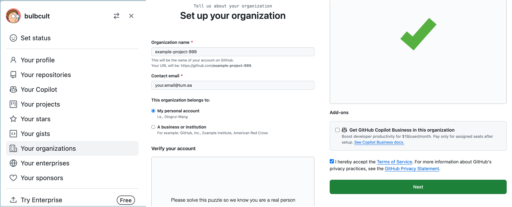

<div align="center">   
  
# Paper-oriented Website Building

🌍 [Project Page](https://paper-website.github.io/) • 🤓 [Paper](https://paper-website.github.io/) 

</div>

[**TL;DR**] This repo contains a starter tutorial to build the paper website which aims to convey the concept of papers in a more straightforward, intuitive and easy-to-understand way.

## 1. Start Here: 
### 1.1 Create a new github organization
First, click your github profile image, on the pop up panel, find ```Your Organizations``` button and click it. Then click ```New organization``` to create a new, free organization named ```example-project-999``` (just give your organization with any unique name), from now on, we use ```example-project-999``` as the example:



### 1.2 Create website repo from import
Within the just built organization, import paper-website repo to create a new repo with name: ```example-project-999.github.io```, link to be imported is below:

```bash
https://github.com/paper-website/paper-website.github.io
```

### 1.3 Deploy the website
Now you can deploy the website and just wait for a few minutes, you can get to the setting page option, your will find the generated website link.

## 2. Play with it: 
### 2.0 Modify your website locally
Git clone the source code of your website repo:
```bash
git clone https://github.com/example-project-999/example-project-999.github.io
cd example-project-999.github.io
```
Use any editor or simply ```code .``` to open your project ```example-project-999.github.io```.

### 2.1 Try to change the title
In ```index.html``` file, change ```<title>Paper-oriented Website Building</title>``` into anything you like. Remember, there are two titles: one for the browser tab, one for the main content. 

Then, push the modification to your remote repo: 
```bash
git add .
git commit -m "Something to commit"
git push -u origin main
```
If everything work well, get into your website, wait for several minutes, refresh your website, you should see the title changed.

### 2.2 Try to add a new section called ```Method```
In```index.html``` file, copy and paste below into a space between two sections.
```bash
<section class="section">
  <div class="container is-max-desktop">
    <!-- Method. -->
    <div class="columns is-centered has-text-centered">
      <div class="column is-four-fifths">
        <h2 class="title is-3">Method</h2>
        <div class="content has-text-justified">
          <p>
            A new method!
          </p>
        </div>
      </div>
    </div>
    <!--/ Method. -->
</section>
```
Again, push the modification to your remote repo with the same commands as shown in ```2.1```.

### 2.3 Try to make the empty video slot show a dog video
In ```index.html``` file, from line 147 to line 171, change something to make the dog video pop up.


### PS. If you are using VScode
In your extension, add ```open in browser```, this can locally compile your website on your browser. When it is installed, right click on your ```index.html```, you will see ```Open In Default Browser``` and ```Open In other Browsers```. Click ```Open In Default Browser```, it will open a tab on your default browser automatically. If it doesn't work, click ```Open In other Browsers``` and choose other browsers. 

Another time, push the modification to your remote repo with the same commands as shown in ```2.1```.

## FAQ:
1. why a new organization is needed?

With a organization uniquely named ```ABC123``` with its repo named ```ABC123.github.io```, you will get your website domain name to be ```https://ABC123.github.io/```, which is short and looks good.

However, if you build your website directly in a repo under your account ```Trueman-Don```, with its repo named ```ABC123.github.io```, you will get your website domain name to be ```https://trueman-don.github.io/ABC123.github.io/```, which is quite long and not so easy to remember.